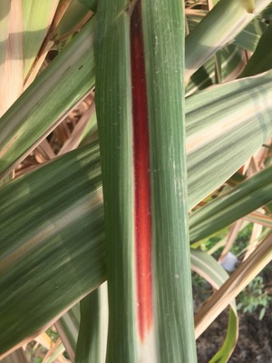

# sugarcane_rot_red_disease_classsification
This project demonstrates image classification for Red Rot Disease in sugarcane using deep learning techniques with TensorFlow
# [Dataset](https://www.kaggle.com/datasets/alihussainkhan24/red-rot-sugarcane-disease-leaf-dataset)
### Dataset Description
- This dataset is about images of sugarcane with half having red rot disease and half of the images are of healthy sugarcane
- Total images : 1024
- It consists of 3 folders - Images/Healthy(427-images) , Images/Unhealthy(437-images) , test set(115-images)
  <table>
  <tr>
    <td></td>
    <td></td>
  </tr>
</table>

# Requirements
- Tensorflow
- Matplotlib
- Numpy
- Pandas
